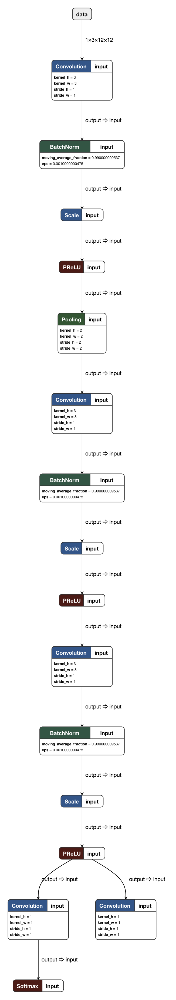

### 深度学习模型的转换

由于各种深度学习框架的层出不穷，我们在进行算法开发到算法部署的过程中，往往都需要用到不同的框架。例如我们很有可能使用tensorflow,pytorch等进行算法开发和调试，在早期工程inference的时候我们往往使用较为轻量的caffe或者魔改后的caffe。到了移动端部署我们可能会使用feather CNN nihui的NCNN或者小米的mace等框架。facebook ONNX的出现为模型的转换提供了一种思路，但除了pytorch等框架能很好的支持ONNX。其他等框架并未很好的对接ONNX。在[MMdnn](https://github.com/Microsoft/MMdnn)出现之前，大家都把caffemodel作为一个中间体来进行转换。

其实就模型转换而言只是个填参数的过程，把模型结构搭好，把参数填进去就即可，但是实践过的朋友大家一定会知道这其中存在不少坑，但是我们更希望有一种自动化的模型转换方案来进行模型转换。

[MMdnn](https://github.com/Microsoft/MMdnn)的出现为模型转换带来了不少的福音，[MMdnn](https://github.com/Microsoft/MMdnn)提供了一种IR(中间表示)来来衔接各个模型之间的转换。他囊括并支持了主流的DNN框架。

下面我就简要讲一下几个的简单模型转换

在此我推荐一个查看模型结构的工具[Netron](https://github.com/lutzroeder/Netron) 支持数种主流深度学习框架(Caffe,Tensorflow,ONNX等)的模型结构查看。

例如下图是MTCNN Pnet的模型结构图




### MMdnn的安装

[MMdnn](https://github.com/Microsoft/MMdnn)的安装非常简单

```
pip install mmdnn
```

#### 转换中的一些坑

##### 1.并不是所有Layer和所有网络都支持转换

由于各个深度学习框架之间的设计模式不同有的是基于命令式的有的是基于符号形式的。各个框架之间的op的粒度不同，又由于没有一个统一的标准，支持所有框架之间的转换是一件非常难的事情。MMdnn也只是把一些提供的常用的op，如conv,pooling等常规op。

##### 2.Tensorflow与caffe的padding方式并不相同

这个问题会出现在MobileNet在转换的过程中，因为Tensorflow的padding方式和其他框架是不同的。Tensorflow标准的卷积操作通常采用非对称的padding，而caffe等其他框架的卷积操作则是采用对称的padding。

如下图 ，比如当 卷积核的大小为3x3 stride为2的时候。尽管他们的padding方式不同，但卷积之后的尺寸确是一样的。


#### 转换步骤

例如现在我们想把MTCNN的Keras Pnet转化成caffeodel用于部署。

```
mmtoir -f keras -w pnet.h5 -o pnet
```

把keras模型转化成MMdnn IR中间表示，在当然目录下会生成一个.npy 的weights文件和一个.pb文件。接着使用

```
mmtomodel -f caffe -in pnet -iw pnet.npy -o pnet
```

